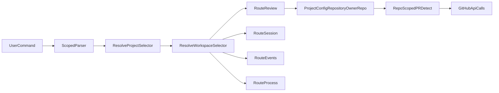

<!-- 433ff376-9e02-49ba-8515-3893acaa22e2 -->
---
todos:
  - id: "add-scope-resolvers"
    content: "Implement project/workspace selector resolution helpers (project name or owner/repo selector)"
    status: pending
  - id: "wire-scoped-commands"
    content: "Add project->workspace command tree in index.ts with review/session/events/process routing and bare context+help output"
    status: pending
  - id: "enforce-explicit-session-attach"
    content: "Add session subcommands with required --session for attach and no implicit shell/attach behavior"
    status: pending
  - id: "normalize-events-process-scope"
    content: "Update events/process command handlers to accept project/workspace scoped identifiers"
    status: pending
  - id: "enforce-review-repo-source"
    content: "Use ProjectConfig.repository owner/repo for review import/push and repo-scoped PR detection"
    status: pending
  - id: "update-tests-and-docs"
    content: "Add/update tests for repo enforcement and scoped commands; update README with new workspace-first flow"
    status: pending
isProject: false
---
# Workspace-Scoped Commands + Project Owner/Repo Enforcement

## Goal
- Make workspace operations (review/events/process/session) primarily run under explicit project+workspace scope.
- Enforce review import/push target from `ProjectConfig.repository` (`owner/repo`) so org ownership is explicit per project.
- Keep behavior deterministic: no implicit shell/session attach.

## What We Learned From Current Branch
- New workspace events/process transport already exists end-to-end (`src/lib/remote-session/protocol.ts`, `src/lib/remote-session/session-handler.ts`, `src/session/*`).
- Current review GitHub targeting derives owner/name from local git context (`gh repo view`) in `src/core/github-review.ts`, not project config.
- Existing `process` command still treats workspace as filesystem path (`--workspace <path>`) in `src/commands/process.ts`.
- `ProjectConfig.repository` is already owner/repo in config (`src/types/config.ts`), so it is the right canonical source.

## Command Model To Implement
- Canonical scoped path:
  - `gssh project <projectSelector> workspace <workspaceSelector> ...`
- Workspace command group also available directly:
  - `gssh workspace ...` with explicit `--project`/`--workspace` where needed.
- Bare scoped node (`gssh project 
 workspace <w>`) prints:
  - context summary, and
  - short next-step help (review/session/events/process examples).
- Session behavior:
  - `session new` and `session attach` only.
  - `session attach` must require explicit `--session <id>` and fail otherwise.
  - no implicit attach/shell from scoped workspace command.

## Org/Repo Enforcement For Review
- Use project repository as canonical GitHub target (`owner/repo`) for review import/push.
- Parse owner/repo from resolved project config, pass through review execution path.
- Stop using `gh repo view` owner/name discovery for review operations.
- Make PR detection repo-scoped (`gh pr view --repo <owner/repo>`) to avoid fork/remote ambiguity.

## Implementation Steps
1. Add project/workspace selector helpers:
- Resolve project by either project name or explicit `owner/repo` selector (using project catalog/config lookup).
- Resolve workspace by canonical id/name using existing workspace-id helpers.

2. Add scoped command tree in `src/index.ts`:
- `project <projectSelector> workspace <workspaceSelector> review ...`
- `... session list|new|attach`
- `... events list|show|tail`
- `... process list|start|stop|attach`
- Keep existing top-level review/events/process commands as compatibility aliases that call the same handlers.

3. Add explicit session subcommand handlers:
- New command handlers to list/new/attach sessions for a resolved workspace.
- Enforce `attach --session <id>` required; provide actionable error message.

4. Normalize events/process command inputs:
- Update `src/commands/events.ts` and `src/commands/process.ts` to support project/workspace identifiers as first-class scope (not only cwd/path).
- Reuse existing workspace scanning/resolution logic.

5. Enforce review repo target from project config:
- Update `src/core/review-executor.ts` to provide canonical repo to GitHub review helpers.
- Update `src/core/github-review.ts` and `src/core/review.ts` PR detection path to use repo argument.
- Validate project repository format is `owner/repo`; fail fast with remediation text if invalid.

6. Docs and test updates:
- Update command docs/help text in `README.md` to show scoped command flow.
- Add/extend tests in:
  - `src/core/__tests__/github-review.test.ts` (repo-target enforcement + `--repo` PR lookup)
  - `src/commands/__tests__/events.test.ts` and `src/commands/__tests__/process.test.ts` (scoped inputs)
  - new scoped CLI command tests (session attach requires explicit `--session`).

## Routing/Data Flow

## Key Files
- `src/index.ts`
- `src/commands/review.ts`
- `src/commands/events.ts`
- `src/commands/process.ts`
- `src/core/review-executor.ts`
- `src/core/github-review.ts`
- `src/core/review.ts`
- `src/core/project-catalog.ts`
- `README.md`